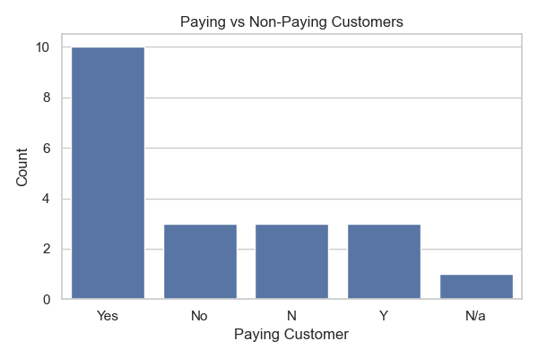
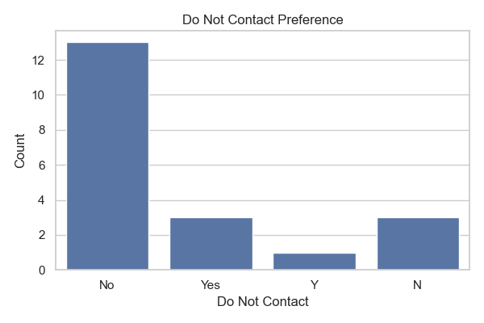
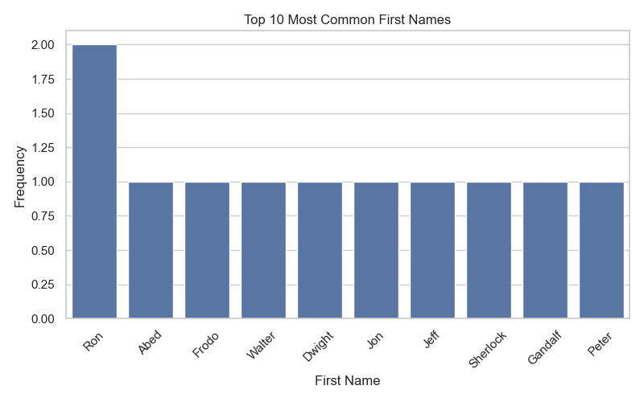

# 📞 Customer Call Data Cleaning & EDA

This project focuses on cleaning and exploring customer call list data using Python. It demonstrates how to handle missing values, standardize data, remove unnecessary columns, and visualize key insights through graphs.

## 📂 Project Structure

```
customer-call-data-cleaning-eda/
│
├── Customer Call List.xlsx                # Original dataset
├── Refined_Customer_Call_List.xlsx        # Cleaned dataset
├── clean_and_plot.py                      # Python script for data cleaning and visualization
├── Paying_vs_NonPaying.png                # Bar chart: Paying vs Non-Paying customers
├── Do_Not_Contact_Distribution.png        # Bar chart: Do Not Contact status
├── Top_10_First_Names.png                 # Bar chart: Top first names
└── README.md                              # Project documentation
```

## 🛠️ Tools Used

- **Python 3.x**
- **Pandas** – Data manipulation and cleaning
- **Matplotlib** – Plotting static visualizations
- **Seaborn** – Enhanced plots and count charts
- **Jupyter Notebook** *(optional)* – For interactive exploration

## 📊 Key Features

- Clean raw customer call data
  - Standardize column names
  - Handle missing and duplicate values
  - Remove irrelevant columns
- Generate insightful plots:
  - Distribution of paying vs. non-paying customers
  - "Do Not Contact" preference status
  - Top 10 most common customer first names

## ▶️ How to Run

1. Clone this repository:
   ```bash
   git clone https://github.com/aman-7831/insights-from-customer-calls
   cd customer-call-data-cleaning-eda
   ```

2. Install the required packages:
   ```bash
   pip install pandas matplotlib seaborn openpyxl
   ```

3. Run the script:
   ```bash
   python clean_and_plot.py
   ```

4. Check the folder for the cleaned Excel file and generated plots.

## 🖼️ Sample Visuals

| Paying Customers | Do Not Contact | Common Names |
|------------------|----------------|--------------|
|  |  |  |

## 📌 License

This project is licensed under the [MIT License](LICENSE).

---

**Author:** Aman Bhandari
